<div align="center">



# convcommit

**Interactive [Conventional Commits](https://www.conventionalcommits.org/) builder for the terminal**

[](LICENSE)
[](bin/convcommit)
[](https://www.conventionalcommits.org/)
[](#installation)
[](Manifest.toml)
[](https://github.com/francescobianco/convcommit/stargazers)

</div>

---

## ✨ Features

| | |
|---|---|
| 🎹 | **Interactive keyboard menu** — pick type, scope, message with a single keypress |
| 🚀 | **Direct flags** — bypass the selector for scripts and AI agents |
| 📦 | **`--add` flag** — stage specific files and commit in one command |
| 🔁 | **`--all` + `--push`** — full workflow in a single one-liner |
| 🛡️ | **Pre-flight checks** — catches empty trees and stale branches _before_ you commit |
| 🤖 | **Pipe / stdin mode** — fully scriptable, works in CI and LLM contexts |
| ⚙️ | **`.convcommit` config** — per-project vocabulary, committed and shared with the team |
| 🅰️ | **Forced letter syntax** `[X]value` — craft memorable keybindings in your config |
| 🦀 | **Zero dependencies** — single bash file, installs anywhere |

---

## 📦 Installation

**System-wide** (recommended):
```sh
curl -fsSL https://raw.githubusercontent.com/francescobianco/convcommit/refs/heads/main/bin/convcommit \
  -o /usr/local/bin/convcommit && chmod +x /usr/local/bin/convcommit
```

**Per-project** (committed into the repo, great for teams):
```sh
curl -fsSL https://raw.githubusercontent.com/francescobianco/convcommit/refs/heads/main/bin/convcommit \
  -o bin/convcommit && chmod +x bin/convcommit
```

---

## 🎹 Interactive mode

Run inside a git repo and follow the menu:

```sh
convcommit          # → prints the formatted message only
convcommit -a       # → git add . then commit
convcommit -a -p    # → git add . then commit then push
```

Press the **bracketed letter** `[F]`, `[G]`, ... to select an option.
Press `[.]` to type free text when the `_` entry is available.

---

## 🚀 Direct flags — recommended for scripts and AI agents

Bypass the interactive selector entirely with explicit flags:

```sh
convcommit --type fix --scope auth --message "fix null pointer"
convcommit -t feat -s api -m "add endpoint" -a -p
```

---

## 📦 `--add` flag: stage specific files and commit in one command

This is the **cleanest pattern** when committing selected files.

**❌ Anti-pattern** (nested command substitution — verbose and fragile):
```sh
msg=$(convcommit --type fix --scope auth --message "fix null pointer") \
  && git commit -m "$msg" \
  && git push
```

**✅ Recommended** — one liner, readable, safe:
```sh
convcommit --add src/auth.sh --type fix --scope auth --message "fix null pointer" --push
```

The `--add` flag is **repeatable** — stage as many files as you need:
```sh
convcommit --add src/auth.sh --add tests/auth_test.sh \
  -t test -s auth -m "add auth unit tests" -p
```

---

## 🤖 Pipe mode — CI and LLM/AI agents

When stdin is **not a TTY**, convcommit reads selections line-by-line.
Each line corresponds to a stage: **type → scope → message**.

```sh
# F = feat, empty line = no scope, then the message
printf "F\n\nadd endpoint\n" | convcommit -a -p
```

Use `.` to trigger free-text input mid-pipe:
```sh
printf "G\n.\nfix null pointer in login\n" | convcommit
```

Capture just the formatted message for injection elsewhere:
```sh
msg=$(printf "G\n\nfix null pointer\n" | convcommit)
echo "$msg"
# → fix: fix null pointer
```

---

## ⚙️ Options

| Option | Description |
|---|---|
| `-t`, `--type <type>` | Commit type — bypasses the interactive selector |
| `-s`, `--scope <scope>` | Commit scope — bypasses the interactive selector |
| `-m`, `--message <msg>` | Commit message — bypasses the interactive selector |
| `-A`, `--add <file>` | Stage a specific file (repeatable) |
| `-a`, `--all` | Stage all changes (`git add .`) before committing |
| `-p`, `--push` | Push to remote after committing |
| `--reset` | Regenerate `.convcommit` with latest defaults |
| `-V`, `--version` | Print version and exit |
| `-h`, `--help` | Print help and exit |

---

## 🗂️ Configuration — `.convcommit`

On first run, convcommit **auto-creates** a `.convcommit` file in the current directory.
Commit this file to share the project's commit vocabulary with your team.

### Format

```
type:<value>      — commit type option
scope:<value>     — commit scope option
message:<value>   — commit message template
```

### Special prefixes

| Prefix | Effect |
|---|---|
| `~<value>` | Default selection (highlighted with ★) |
| `_` | Enables free-text input (press `.` in the menu) |
| `[X]<value>` | Forces letter `X` for this entry, overriding the sequential counter |

### Default letter assignment

With the default config, the type menu looks like this:

```
[B] build    ★[C] chore    [D] docs     [E] deps
[F] feat      [G] fix      [H] ci       [I] init
[J] merge     [K] perf     [L] refactor [M] revert
[N] security  [O] style    [P] test     [W] wip
[.] type freely
```

`[B]`, `[D]`, `[W]` are **forced** to skip `A`, keep `D` for docs, and assign the memorable `W` for wip.
Everything else follows **alphabetical order** — no chaos, no need to memorise a map.

### Customize scopes for your project

```
scope:~
scope:_
scope:api
scope:auth
scope:ui
scope:db
scope:ci
```

This gives your team a curated vocabulary while still allowing free text via `_`.

### Regenerate defaults

```sh
convcommit --reset
```

---

## 🛡️ Pre-flight checks

When running **interactively** (stdout is a TTY), convcommit validates the environment before opening the selector — so you never waste time building a message only to fail at the git step:

| Check | When |
|---|---|
| Working tree is not clean | Before any commit (`-a` or `--add`) |
| No remote configured | Before `--push` |
| Branch is behind remote | Before `--push` (prevents rejected pushes) |

> ℹ️ Checks are **skipped** when stdout is captured (`msg=$(convcommit ...)`) — this is intentional and allows message-only generation without touching git state.

---

## 💡 Developer experience tips

**Full release workflow in one shot:**
```sh
convcommit -a -p
```

**Commit a built binary with a typed message:**
```sh
convcommit --add bin/mytool -t build -s bin -m "update binary" -p
```

**Let an AI agent commit without interaction:**
```sh
convcommit --type feat --scope ui --message "add dark mode toggle" --all --push
```

**Evolving project vocabulary? Just reset:**
```sh
convcommit --reset && convcommit -t chore -s config -m "refresh convcommit defaults" -a -p
```

---

## 🤝 Contributing

We welcome contributions! Feel free to fork the repository, submit pull requests, or open issues for any improvements or bug fixes.

## 📄 License

This project is licensed under the **MIT License**.
